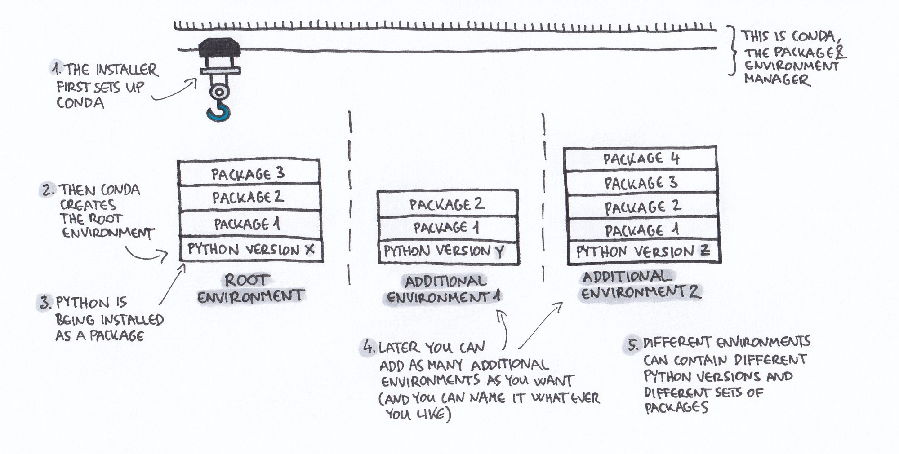
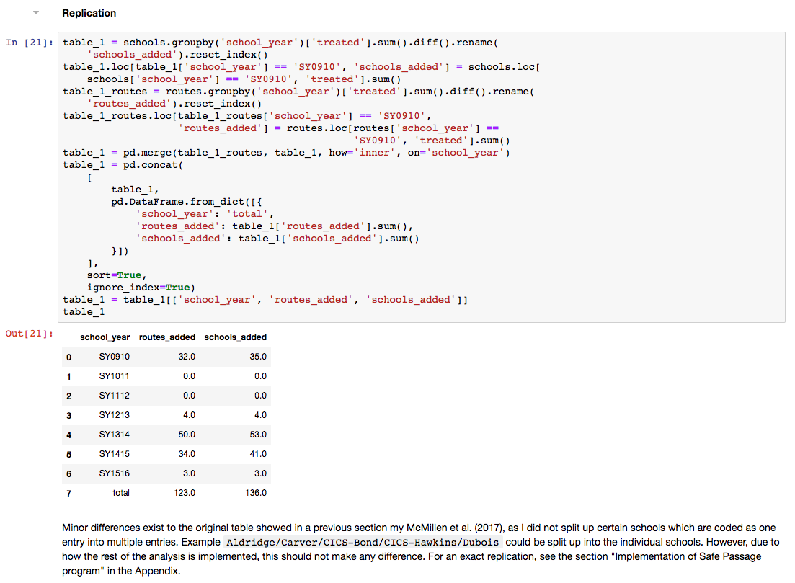


## Package and environment manager
When a new version is released, software changes its behavior. Even though the changes are usually improvements, and therefore desired, they can make reproducing someone else's work a lot harder if you don't have access to the exact same software version that was used in the analysis. Furthermore, if you update a tool for one project, this might prevent the code in another project from running smoothly (as the latter might depend on the old functionality of the software). You might think changing from version 4.2.1 of a software to version 4.2.2 isn't a big deal, but you'd be surprised how often exactly these small things lead to confusion and unwanted changes in the results.

If you are a Python or R user, both of these issues can be solved easily by using a package and environment manager such as conda. Conda will allow you to create a separate and isolated installation of the respective programming language as well as all packages needed for each project. These separate installations are called "environments" and will only be used for this specific project and a package installed in one environment will not be available in others. If you then update a package to get some new functionality, this will only happen for the chosen project and it will not interfere with other projects in any way. Additionally, using conda, you will be able to easily export the specifications of the software used in an environment to a file, which others then can use to recreate the exact same environment, consisting of the same Python or R as well as package versions. We will learn how to do this in the section on “Documentation”. The following awesome illustration by Gergely Szerovay might explain conda and environments a lot better than I ever could.


{: .full}
*<small>Source: [Why you need Python environments and how to manage them with Conda - Medium](https://medium.freecodecamp.org/why-you-need-python-environments-and-how-to-manage-them-with-conda-85f155f4353c)</small>*

### Installation
The first step on the illustration refers to the installer of conda, for which we will use [Miniconda](https://conda.io/miniconda.html){:target="_blank"}, as it is the most lightweight way to install conda on any of the common operating systems. When downloading Miniconda, you will need to choose between Python 2 and 3, no matter if you are a Python or R user. For the latter, don't worry, you'll never need to write anything in Python. In any case, download the Python 3 version of Miniconda and install it. If you need help, check out [the official installation guide for your operating system](https://conda.io/docs/user-guide/install/index.html#regular-installation).

**Note**: See [python3statement.org](https://python3statement.org/){:target="_blank"} on why you should always use Python 3 over 2 for your projects.
{: .notice}


After the installation of Miniconda, conda will automatically create a so called "root environment" which will contain a Python 3 installation (step 2. and 3. on the illustration above). This will be the environment which is activated by default, i.e. without you doing anything. You can now open your terminal and type `python` and you should be greeted by the usual Python 3 command shell. Back in your terminal, you can install packages either by using `pip install package_name`, or by using conda and typing `conda install package_name`. Most of the commonly used packages can be installed using the latter and this is actually the recommended approach. Conda has a much better dependency resolution than pip and using conda will therefore just make your life a whole lot easier.

## Using environments
For each project, as described above, you want to set up a new environment using conda. To do this, run the following command in your terminal and replace `environment_name` with a name identifying your project and `3.X` with the Python 3 version you want (usually the most recent one).

`conda create -n environment_name python=3.X`

Now, activate the environment with:

`conda activate environment_name`

Remember to always do this before working on your project. If you now again type `python` into your terminal, it will call the Python installation of the activated environment `environment_name`. The installation of additional packages is exactly the same as for the root environment, as both conda and pip will always install packages in the currently activated environment (and if non is activated into the root environment as we have seen before).

To get back to the root environment, simply type the following into your terminal:

`conda deactivate`

For more information on how to use conda environments, see [the official documentation](https://conda.io/docs/user-guide/tasks/manage-environments.html).


<details>
  <summary>Continue with the instructions for Python users</summary>
<div class="notice--info">
  {{ python-text | markdownify }}
</div>
</details>


After the installation of Miniconda, conda will automatically create a so called “root environment” which will contain a Python 3 installation (step 2. and 3. on the illustration above). This will be the environment which is activated by default, i.e. without you doing anything. However, as you seem to be an R user, you might not be interested in the Python installation and certainly want to install R along side it. Conda makes this really easy for you. Just type the following into your console, which will install R as well as a lot of useful packages such as "tidyverse". For a full list see [the documentation on anaconda.com](https://docs.anaconda.com/anaconda/packages/r-language-pkg-docs#){:target="_blank"}.

`conda install -c r r-essentials`

I can also highly recommend you to install [RStudio](https://www.rstudio.com/){:target="_blank"}, which is a very good integrated development environment (IDE) for programming in R. I will tell you a bit more about it later on this page. To install it, type the following in your terminal:

`conda install -c r rstudio`

You can now start RStudio by typing `rstudio` in your terminal. The easiest way to install additional packages is using conda itself. Most of the commonly used packages, if not already installed by r-essentials, are available on conda. Usually, you can find installation instructions by googling for "conda" and the package name. However, the general pattern to install a package "packagename" is:

`conda install -c r r-packagename`

If a package is not available via conda, you can also install it over the usual way of running `install.packages("package_name")` inside R or RStudio.

## Using environments
For each project, as described above, you want to set up a new environment using conda. To do this run the following command in your terminal and replace environment_name with a name identifying your project.

`conda create -n environment_name`

Now, activate the environment with:

`conda activate environment_name`

Remember to always do this before working on your project. Now you again want to install r-essentials and RStudio to have access to them in your new environment. You can do this using the same commands as above, as long as you have still activated the environment. If you now type `rstudio` into your console, it will open the RStudio (and R) installation of the activated environment.

To get back to the root environment, simply type the following into your terminal:

`conda deactivate`

For more information on how to use conda environments, see [the official documentation](https://conda.io/docs/user-guide/tasks/manage-environments.html).

<details>
  <summary>Continue with the instructions for R users</summary>
<div class="notice--info">
  {{ r-text | markdownify }}
</div>
</details> <br />

## Notebooks
Now that we know how to set up our programming language as well as install additional packages, it is time to look at in what environment we might want to do the actual coding. What I usually did in the beginning, was writing my code in .py or .R scripts and then running these scripts to do everything from data preparation over visualization up to modeling. However, the big drawback of this is, that you have to write out any output such as figures, text, and tables generated by the code to other places. Additionally, you would document any findings into a separate LaTeX or Word document. This is rather inconvenient when doing a data analysis, as quite often when you have an idea, it would be way better if you could save it, alongside with the execution and the corresponding output all in one place. Doing your analysis using scripts breaks up these parts and makes it harder to actually connect them again. Furthermore, you might not want to write whole scripts and execute them, but want to interactively execute commands and then inspect the output.

This is where so called *notebooks* shine. They allow you to integrate code as well as visualizations, mathematical equations, and narrative text (using markdown or even LaTeX), all in one document. This allows for an iterative exploration of your data as well as a rich-formatted documentation right next to it. You can even export the notebooks as .html, .pdf, .tex, etc., files. Notebooks will be an important aspect of the workflow presented in this guide, with the most prominent proponent being *Jupyter notebooks*.




Include screenshot


A live demo will probably give you a better idea of what notebooks are. Head over to the [official Jupyter website's 'Try' section](http://jupyter.org/try){:target="_blank"} to try out example notebooks for Python, R, Julia, and C++, directly runnable in your browser without any installation! Another great example for Python is the notebook on [the discovery of gravitational waves by the LIGO collaboration](https://mybinder.org/v2/gh/minrk/ligo-binder/master?filepath=index.ipynb){:target="_blank"}. For R users, [R notebooks by RStudio](https://rmarkdown.rstudio.com/r_notebooks){:target="_blank"} are a great alternative to Jupyter notebooks and for the rest of this guide it does not matter which of the two you use.

Jupyter notebooks support many more than the previously mentioned languages, and you can do your analysis in Stata, Matlab, and dozens of other languages. Head over to [this list of all available languages in Jupyter](https://github.com/jupyter/jupyter/wiki/Jupyter-kernels){:target="_blank"} to find out if yours is among them.

### Installation
If you have followed the installation instructions given above for Python or R users, you can simply type the following command in your terminal to install Jupyter notebooks:
```bash
conda install jupyter
```
Now you can start the Jupyter notebook interface by running:
```bash
jupyter notebook
```
There are many good beginner tutorials on Jupyter out there, such as [this one from DataQuest](https://www.dataquest.io/blog/jupyter-notebook-tutorial/){:target="_blank"}, which will teach you the basics on how to use the notebooks.

**Note**: If you like Jupyter notebooks, also take a look at [Jupyter lab](http://jupyterlab.readthedocs.io/en/latest/){:target="_blank"}. It contains all of the functions of Jupyter notebooks plus many additional cool features and will eventually be the successor of the notebooks. It is certainly worth checking out, even though currently it is still missing some of the most useful Jupyter notebook extensions. However, you are able to switch easily between the two, even on already existing documents, and it does therefore not matter much with what you start.
{: .notice}

## Code editor
Even if you follow a notebook-based workflow, you'll end up needing a code editor sooner or later, for example when putting functions into separate scripts to declutter your notebooks (more on this in the section "Other stuff"). If you are an R user and you have R Studio, you already have a very good editor and you can probably stop here. For R users without R Studio or Python users, I can greatly recommend [Microsoft Visual Studio Code](https://code.visualstudio.com/){:target="_blank"}, but other good alternatives include [Atom](https://atom.io/){:target="_blank"} and [Sublime Text](https://www.sublimetext.com/){:target="_blank"}.

Your development environment should now be set up in a way which not only is convenient for you, but also allows others to more easily understand and replicate your research. [Next, we will look at how to set up a folder structure that keeps everything well organized right from the beginning.](./folder_structure)
