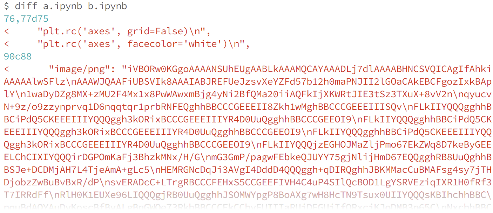
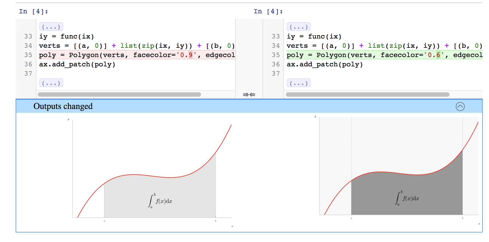
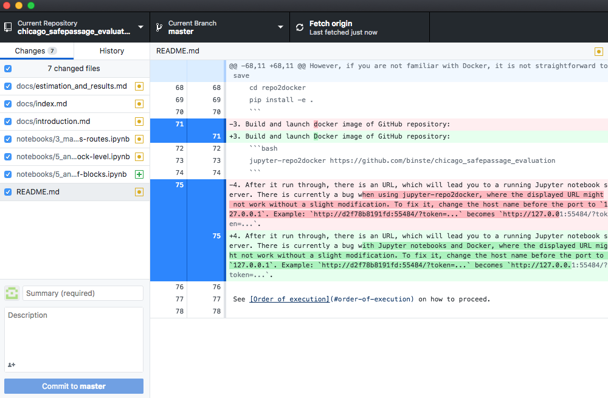

Putting your project under version control can greatly help you make your project reproducible. It lets you try out different versions of an analysis and still revert back to a previous one. Furthermore, it can save yourself a lot of time down the line when you want to track down a bug and you are not sure when it got introduced or how the code looked before you changed that one buggy function.

A prominent option for a version control system is [Git](https://git-scm.com/){:target="_blank"}. It allows you to easily keep track of all the changes that you or your collaboraters make to text based files (text documents, code files, etc.) over time while working on a project. A project that is versioned using git can then easily be hosted online to share it with the world using the free web service [GitHub](https://www.github.com){:target="_blank"}. It also includes many useful tools for collaboration with others. Git and GitHub offer a lot of functionality, which might feel overwhelming at first. But don't worry, it really is sufficient to just focus on the basics (see the tutorials mentioned below) to get up and running with version control and apply it to your project.

**Note**: While working on a project that is hosted on GitHub, you can set the project to private mode, which will prevent others from accessing it until you make it public.
{: .notice}

## Installation of the necessary software
To install Git, follow the respective installation guide for your operating system linked in this [DataCamp Tutorial](https://www.datacamp.com/community/tutorials/setup-data-science-environment#how-to-install-git){:target="_blank"}. This is basically all the software you need to put your project under version control. However, there is one tool, that makes your life easier if you use Jupyter notebooks. Git has a command `git diff` that you will learn to use to display differences between two versions of a file. However, it won't give you a very helpful output for Jupyter notebooks because of the underlying format they have and it might look something like this:


*<small>Source: [nbdime documentation](https://nbdime.readthedocs.io/en/latest/){:target="_blank"}</small>*

Even if you would already know how to read the output of a `git diff` command, thats just not helpful at all. Luckily, [nbdime](https://github.com/jupyter/nbdime) provides various tools to make Jupyter notebooks and Git work in harmony. One of them even gives you an actual graphical user interface to access changes.


*<small>Source: [nbdime documentation](https://nbdime.readthedocs.io/en/latest/){:target="_blank"}</small>*

How cool is that? You can install with conda by typing the following command in your terminal:
```bash
conda install -c conda-forge nbdime
```
Now you need to set up the git integration with

```bash
nbdime config-git --enable --global
```
That's it. Git now is Jupyter notebook compatible. See the [nbdime documentation](https://nbdime.readthedocs.io/en/latest/){:target="_blank"} for examples on how to use it.

## Command line vs. GitHub Desktop
Now you are ready to put your first project under version control and create your first repository.

>"A repository, or Git project, encompasses the entire collection of files and folders associated with a project, along with each file’s revision history." - [Git Handbook GitHub Guides](https://guides.github.com/introduction/git-handbook/){:target="_blank"}

To interact with Git, you have two options. You can either issue commands to it over the command line or use a graphical user interface (GUI) such as [GitHub Desktop](https://desktop.github.com/){:target="_blank"}. Compared to the later, the command line offers more flexibility in terms of what you can do as well as where - think of working remotely over command line on a server. But again, if you have never worked over the command line before, the following might look more appealing to you:



You can find all the information for an easy setup and usage of GitHub desktop in the official guides [Getting Started with GitHub Desktop](https://help.github.com/desktop/guides/getting-started-with-github-desktop/){:target="_blank"} and [Contributing to projects with GitHub Desktop](https://help.github.com/desktop/guides/contributing-to-projects/){:target="_blank"}, which also show how to add your own project to GitHub using the GUI. For an introduction to the command line interface, I highly recommend the free DataCamp course [Introduction to Git for Data Science](https://www.datacamp.com/courses/introduction-to-git-for-data-science){:target="_blank"}. Should you plan on doing a smaller project without using Git for collaboration, you're even fine with watching just the first part called "Basic workflow." To connect Git to GitHub over the command line, see the [Set up git](https://help.github.com/articles/set-up-git/){:target="_blank"} tutorial.

## Data
If you have the permission to publish your raw data files, you can also put them into version control and even upload them to GitHub if they fulfill certain size requirements. Single files must be below 100MB, and the total repository should stay below 1GB. Should you not be able to upload your raw data (also for legal reasons), make sure to thoroughly document what data you used. You'll learn how to do this in the upcoming section on "Documentation."

We now know how to set up the programming environment, a well organized folder structure, as well as a version control system - all of which are already of immense value to the clarity and reproducibility of your research project. Maybe you have already started to clean your data in some notebooks. [It is now time to talk about documentation, to make sure that your codebase stays tidy and comprehensible and you have all the important information in the right place](../during_the_analysis/documentation).