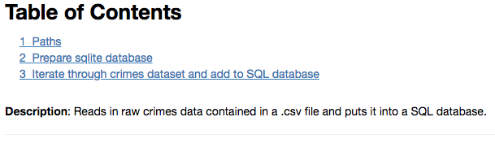

Writing good and up-to-date documentation on your code as well as your data is critical for others as well as yourself to be able to understand what you did and especially why. I highly recommend to integrate writing documentation tightly into your workflow, as it is way easier to continuously note down important information as it arises instead of trying to retrieve it at the end of a project.

## Code
### Scripts and notebooks
At the beginning of every script or notebook, a brief description should summarize its purpose and functionality. In Python, you can use docstrings for scripts:
```python
"""Contains various helper functions
to load crimes from the SQL database.
"""
```
In R, you can use standard inline comments:
```r
# Contains various helper functions
# to load crimes from the SQL database.
```
In notebooks (be it Jupyter or R), you should use the markdown functionality to do the same and optionally also add a table of content. For Jupyter notebooks this can be done with the [toc2 extension](https://jupyter-contrib-nbextensions.readthedocs.io/en/latest/nbextensions/toc2/README.html).



### Functions and classes
#### Python
If you use Python, a good documentation convention is the [Numpydoc format](https://numpydoc.readthedocs.io/en/latest/){:target="_blank"}, which is used to document many popular data science packages. The documentation convention is quite extensive and you certainly don't need to know all of it. A good place to start using it is inside your functions, classes, and methods.

Take the following example of a function defined in Python:

```python
def read_routes_file(shapefile_path, school_year):
    """Reads shapefile of Safe Passage route
    and adds the respective school year as a column

    Parameters
    ----------
    shapefile_path : str
        Path to shapefile which should be read

    school_year : str
        School year in the format of 'SYXXYY',
        for example 'SY1516' for school year 2015-2016

    Returns
    -------
    gpd.DataFrame
        Contains parsed shapefile as well as
        corresponding school year
        as column 'school_year'
    """
    # Code
    ...
    return
```


```python
def load_relevant_crimes(min_date,
                         max_date=None,
                         sqldb_path='data/processed/crimes.db',
                         chunksize=None,
                         disk_engine=None,
                         **kwargs):
    """Loads relevant violent and property crimes

    Wrapper around load_crimes which only loads violent and property crimes.
    Furthermore this function provides an easier interface to load
    relevant columns. If add_violent_col is True an additional column is
    added to the returned dataset with a dummy which is 1 for a violent crime
    and 0 for a property crime.

    Parameters
    ----------
    min_date : str, format = "YYYY-MM-DD"
        Min date which should be loaded

    max_date : str, format = "YYYY-MM-DD", optional (default=None)
        Max date which should be loaded

    sqldb_path : str, optional (default='data/processed/crimes.db')
        Path to SQL database, defaults to relative path
        to crimes database from project root. Useful to change
        for example when using Jupyter notebooks in other directories.

    chunksize : int, optional (default=None)
        If specified, return an iterator where chunksize
        is the number of rows to include in each chunk.

    kwargs : keyword arguments, optional
        Further keyword arguments directly passed on to pd.read_sql_query

    Returns
    ------
    pd.DataFrame
        Dataframe containing loaded crimes
    """
    # Code
    ...
    return
```


<details>
<summary>Show another, more extended, example of a documented function</summary>
<small>
{{ extended-function | markdownify }}
</small>
</details><br />

The first sentence of the docstring briefly summarizes the main purpose of the function. A subsequent paragraph could go into more detail if needed (see the extended example). The `Parameters` section names all function arguments (e.g. `shapefile_path`), their type (e.g. `str`), additional information such as the format or if it is an optional argument if applicable, as well as an explanation. The `Returns` section names the type of the returned object and gives a brief description.

#### R
In R you can use the lines just before defining a function to do the same. A good introduction can be found in the [tidyverse style guide](http://style.tidyverse.org/documentation.html){:target="_blank"}.

### Inline
Throughout your script or notebook, you should provide information on assumptions you make and reasons for why you do non-obvious steps. Remember, this not only helps others, but also yourself!

> “Code tells you how, comments tell you why.” — [Jeff Atwood (Coding Horror)](https://blog.codinghorror.com/code-tells-you-how-comments-tell-you-why/){:target="_blank"}

The following example, which I took from Trey Causey, summarizes rather well what the intent of inline comments should be.

> You've probably heard that you should comment your code many times. So, you wrote things such as:
> ```python
> # import packages
> import pandas as pd
> # load some data
> df = pd.read_csv('data.csv', skiprows=2)
> ```
> These are bad comments. They don't add any information. Why is that skiprows parameter set to 2? Are there comments at the beginning of data.csv? Something like this might be preferable:
> ```python
> # Data contains two lines of description text,
> # skip to avoid errors.
> df = pd.read_csv('data.csv', skiprows=2)
> ```

*<small>Source: [Software development skills for data scientists - treycausey.com](http://treycausey.com/software_dev_skills.html)</small>*

(I myself am guilty of writing `# load data` way too many times...)

## Data
Without documenting what data you used for your analysis, it will be almost impossible to reproduce any results at all. You should therefore always provide exact and up to date information about your raw data files. The following is a non-exhaustive lists of points to include:

* Name of file or folder in `data/raw`
    * If the dataset consists of too many files to list, you can just mention the name of the folder which contains all the files.
    * If you have downloaded the dataset as a compressed archive (e.g. zip), additionally provide the name of the archive.
* Description
* Date on which you downloaded/received the data
* Source
    * This can be anything from a URL where one can directly download the file, to the name of the entity which provided the data.
* Version or identification number
    * Mention any additional information which could help in identifying the exact data you used.
* Application process
    * If you had to apply for the data, try to provide as much information on the process as possible and link to helpful sites.
* Accrued costs for obtaining the data
    * This makes it easier for others to assess if they can afford it and what they have to expect.

Should you not be able to provide the raw data files, it is also very helpful to provide a screenshot of the `data/raw` folder such that others can better reconstruct it.

Where you want to put this information depends on the project you are doing. In an academic paper, some of the information might land up in the paper itself or an appendix. However, you can also just write a simple text document or something like an Excel file and put it in the folder `data/raw`. If your data can be downloaded for free, but you are not able to host all of it on GitHub, I highly recommend you to write a Jupyter or R notebook, which automatically downloads all the necessary files from the original sources and puts them in the correct folder. You can then also include the above gathered information, which is not already contained in the code of the notebook, in form of a markdown table or plain text.

To download a file with Python, I have prepared a function, which you should be able to just copy and use for your own project:


```python
import requests
from pathlib import Path

from tqdm import tqdm_notebook


def download_file(url,
                 filename,
                 force_download=False):
    """Downloads file from the url and saves it to specified filename
    (can contain a path).

    Parameters
    ----------
    url : str
        Url from which file should be downloaded

    filename : str
        Filename under which it should be saved (including file ending).
        This can also include a folder change.

    force_download : bool, optional (default=False)
        If True, forces download even if file already exists

    Returns
    -------
    bool
        If download was completed (can be used for follow up actions such as unzipping)

    Example
    -------
    >>> download_file('https://test.com/school_location_1415.csv',
                      '../../data/raw/school_location/sch_location_1415.csv')

    Notes
    -----
    This function heavily leans on these two stackoverflow threads:
    * https://stackoverflow.com/questions/45978295/saving-a-downloaded-csv-file-using-python
    * https://stackoverflow.com/questions/37573483/progress-bar-while-download-file-over-http-with-requests/37573701
    """
    filename = Path(filename)
    # Check if file already exists
    if not filename.is_file() or force_download:
        print(f'Downloading {filename}')
        r = requests.get(url, stream=True)
        # Check if the response is ok (200)
        if r.status_code == 200:
            # Get total file size in bytes. If download server supports it,
            # this will be a compressed version and the total file size on your
            # hard disk may be larger!
            total_size = int(r.headers.get('content-length', 0))
            block_size = 1024
            wrote = 0
            # Open file and write the content
            with filename.open('wb') as f:
                for block in tqdm_notebook(
                        r.iter_content(block_size),
                        total=math.ceil(total_size // block_size),
                        unit='KB',
                        unit_scale=True):
                    wrote = wrote + len(block)
                    f.write(block)
            if total_size != 0 and wrote != total_size:
                raise Exception(f'Could only download {wrote}/{total_size}')
            download_success = True
        else:
            raise Exception(f'Could not download file. Request status code: {r.status_code}')
    else:
        print(
            'File already exists. Nothing was downloaded. Set force_download=True',
            'to download the file anyway and replace the existing one.')
        download_success = False
    return download_success
```


<details>
<summary>Show download function</summary>
<small>
{{ download-function | markdownify }}
</small>
</details>

<details>
<summary>Show a full "download-data" Jupyter notebook which contains information and sources on all raw data files</summary>
<iframe src="https://nbviewer.jupyter.org/github/binste/chicago_safepassage_evaluation/blob/master/notebooks/0_download_data/0.0-binste-download-data.ipynb" height="1100" width="100%" style="border:none;"></iframe>
</details><br />

**Note**: Don't forget to reference your data documentation in the README file of your project, to which we will get in the section XXX.
{: .notice}

Next to writing informative easily understandable documentation, [there are a few other things you should consider while doing your analysis](./other_stuff).